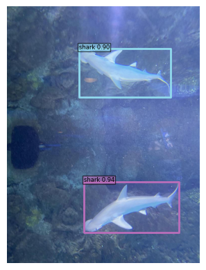

# CVPDL-HW1
## 1. Draw the architecture of your object detector
我使用的 object detector 叫做 "DINO"，來自這篇 [DINO: DETR with Improved DeNoising Anchor Boxes for End-to-End Object Detection](https://openreview.net/pdf?id=3mRwyG5one)。他的架構如下圖所示：

主要可以分成 4 個部分:
1. **Backbone**： 提取圖片的特徵。
2. **Transformer**： 用來做 object detection 的主要部分，利用提取出來的圖片特徵透過 self-attention 來找出圖片中的物件。
3. **Query Selection**： DINO 使用 mixed query selection strategy ，選擇 positions 作為 anchors，並且使用 learnable query embeddings 作為 content queries，選擇出最好的 query，並且利用這些 query 來做 object detection。
4. **Contrastive Denoising Training**： 也就是圖中的 CDN，DINO 利用這個方式來提高 bounding box 的準確度，並且降低重複偵測的問題。

## 2. Implement details
1. **Augmentation**：縮放圖片大小、裁切圖片、水平翻轉圖片、將圖片轉成 tensor、將圖片 normalize。
2. **Loss function**：在定界框的預測上使用 L1 loss、GIOU loss；在類別的預測上使用 focal loss。
3. **Parameter settings**：我使用的 backbone 是 SwinL，batch size 是 1，learning rate 是 0.0001，optimizer 是 AdamW，weight_decay 是 0.0001，訓練 12 個 epoch。其餘的參數都是使用 paper 中的參數。

## 3. Table of your performance for validation set
我用 DINO 本身的 evaluation code 來評估模型的表現，得到的結果如下：
|  AP   | AP50  | AP75  |
| :-:    | :-: | :-: |
| 0.574  | 0.854 |  0.597 |

但我用助教給的 evaluate.py 得到的結果如下：

|  AP   | AP50  | AP75  |
| :-:    | :-: | :-: |
| 0.582  | 0.88649 |  0.6089 |

## 4. Visualization
我是用 `IMG_2514_jpeg_jpg.rf.6ccb3859d75fc5cfe053b1c1474254b2.jpg` 這張圖片來做 visualization，結果如下：

