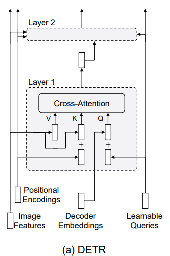
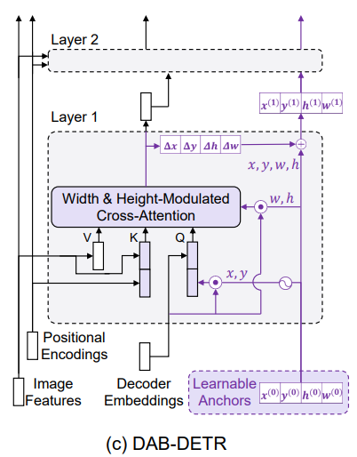
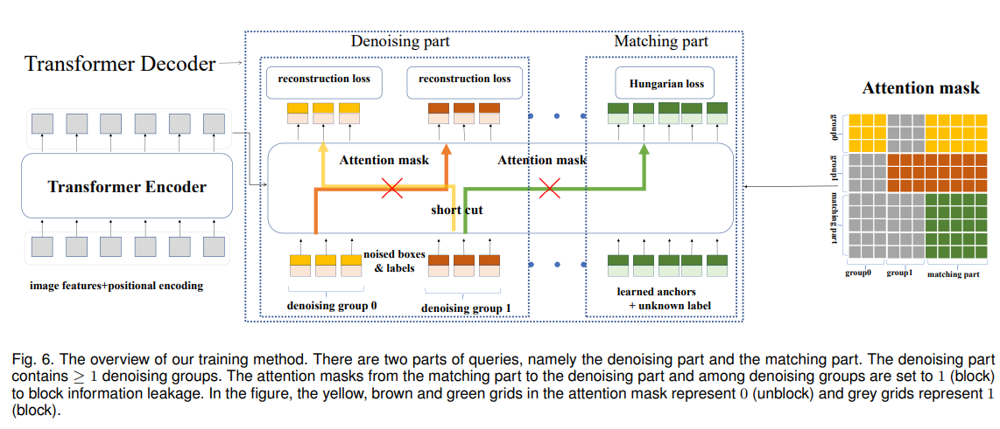
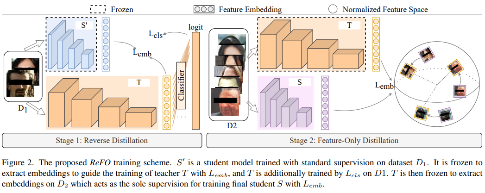
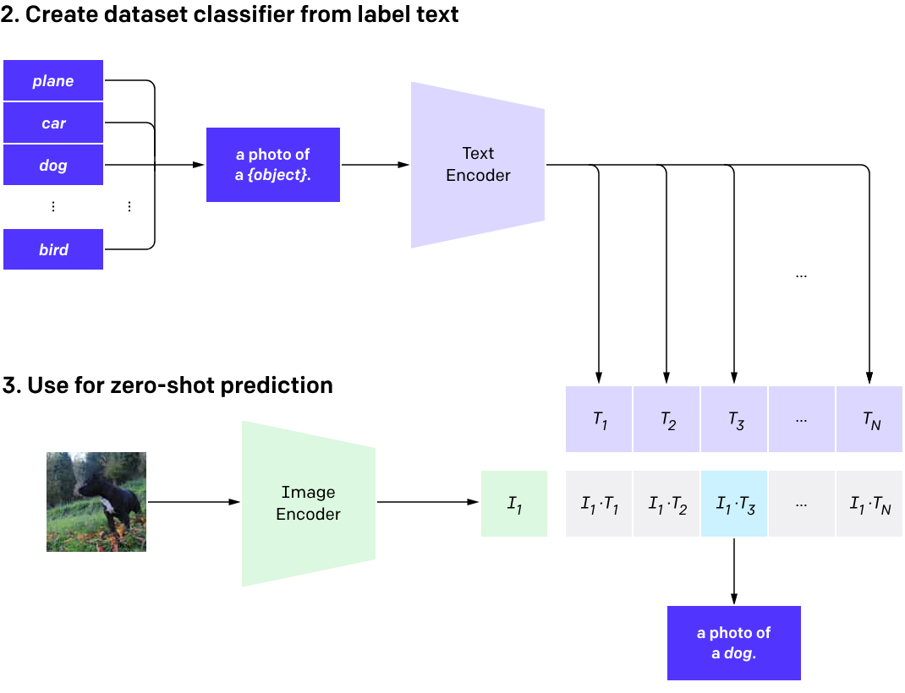
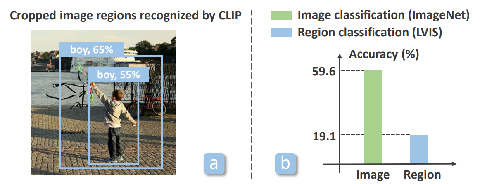
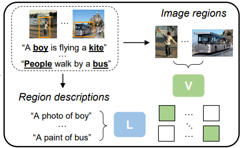
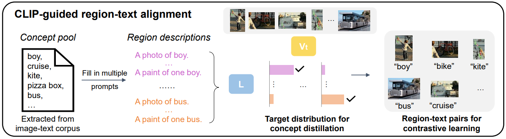
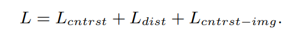

# CVPDL Homework 2

## Generic Object Detection 
1. Current transformer-based object detection models are primarily developed based on DETR. However, we all know that DETR[1] has a drawback, which is slow convergence speed. Please describe why DETR series models have slow convergence speed.

    在 [Rethinking Transformer-based Set Prediction for Object Detection](https://arxiv.org/abs/2011.10881) 論文中提到第一個原因是 bipartite  matching 的隨機性和不穩定性，會導致模型預測的 bounding box 與 ground truth 匹配不穩定，因此造成 Hungarian loss 不穩定，因此導致收斂較慢，但這個原因的影響只在前幾個 epochs，最主要造成收斂慢的原因應該是第二個原因；這篇論文提到的第二個原因則是在 Decoder 中的 cross attention，做實驗發現，隨著訓練週期變高，在 cross attention 上的稀疏性也會越來越高，可以想成是機器注意的地方越來越集中在某些部分，但是即使超過 100 個週期，稀疏性還沒達到一個穩定的狀態，可能代表機器還在尋找該注意哪些部分，因此這篇論文認為 DETR 中 cross attetion 的部分才是主要造成收斂較慢的原因。
    
    在 DAB-DETR 這篇論文中，他針對前面提到的論文中提到的第二個原因進行深入探討，觀察在 Decoder 中的 cross attention 哪個部分才是主要影響原因。而比較 encoder 和 decoder 的架構他們發現有可能是 cross attention query 中的 learnable query 的部分導致收斂較慢。而可能原因有兩個，第一個原因是 queries 可能本來就很難學習，因此他們做實驗觀察，將 queries 固定成已經學習好的 queries，訓練模型其他部分，結果發現只有在前面的幾個週期有些微的提升收斂速度，因此這可能不是主要原因，如果是主要原因的話，固定 queries 應該要大幅提升收斂速度。而第二個原因則是認為 decoder 學習到的 queries 的位置資訊與圖像的 positional embedding 不一致。這裡的不一致可以想成 positional embedding 明確的告訴機器哪個位置對應到哪個 embedding，然而 decoder 學習到的 queries 的位置資訊有可能無法表達這樣的位置關係。他們將學習到的一個 query 的位置資訊與圖片所有的 positional embedding 計算 attention scores 得到 attetion maps，發現有 mutiple head 和 nearly uniform attention weights 的問題，代表機器會同時注意多個地方，或者幾乎整張圖都是機器在注意的地方。但照理來說，因為一個 query 對應到一個物體，所以一個 query 的位置資訊應該要能夠提供機器恰好一個物體位置的資訊才對，因此可說 DETR 的 learnable query 無法有效的提供機器應該要注意圖上哪個部分，進而導致收斂速度較慢。

    結論，導致 DETR 收斂速度慢的原因有兩個，一是在 bipartite  matching 的隨機性和不穩定性，導致模型預測的 bounding box 與 ground truth 匹配不穩定；二是在 decoder cross attention 中的 query 無法有效地提供機器位置資訊，導致機器無法專注在某個物體上。

2. Two well-known papers, DAB-DETR[2] and DN-DETR[3], approach the issue of slow convergence in DETR from different viewpoints. Please describe how they address the issue.

    DAB-DETR 最主要是將 DETR 的 learnable query 改成四維的 learnable anchor box，而 learnable anchor box 中每一個元素分別代表 anchor box 的 x, y, h, w，透過直接學習這四個值，能夠有效的提供機器良好的位置資訊，解決先前總結提到的第二個原因。

     

    DN-DETR 則是在訓練時加入 denoising task 的部分，來改良先前總結提到的第一個原因。在訓練 denoising task 時，是把 ground truth 的 bounding box 或者 label 加入一些 noise 作為輸入餵給 decoder，對於 bounding box 加入 noise，是將真實的 bounding box 做一些偏移或縮放，而對於 labels 加入 noise，則是將 label 換成別的種類的 label，而在訓練時，模型只要專注於如何重建出正確的 bounding box 和 label，透過這個 denoising task，模型本身能夠進行偏移量的學習，並且不需要使用 bipartite  matching 來建立 ground truth 和 prediction 的匹配，解決 bipartite  matching 帶來的不穩定性而導致在偏移量的學習十分困難的問題。
    
    

## Practical Issue 1: Knowledge Distillation 
1. Briefly describe the main differences and advantages between distilled from logits and distilled from intermediate layers.
    
    兩者主要的差異在 loss 計算的地方，前者是利用老師和學生模型的「最終輸出的機率分布」的差異來作為 loss，目的是要讓學生預測出來的機率分布能夠更像老師；而後者則是利用老師和學生模型在中間層所學到「特徵表示」的差異來作為 loss，目的是想要讓學生在學到的特徵表示上能夠越像老師越好。
   
    前者因為只需要老師模型的預測機率分布，就能夠訓練，因此只需要的優點在於容易實作而且可以廣泛用於各種模型和資料集；而後者的優點則是能夠讓學生學到更多與老師一樣的內在資訊，因此可能有更好的泛化性。

2.  How to perform knowledge distillation from logits? Please find a paper from the given top conference list shown in Lecture#1 from 2021 or later discussing certain approaches performing distillation from logits and briefly describing its methodology.

    我找的論文是 [Distilling Global and Local Logits with Densely Connected Relations](https://openaccess.thecvf.com/content/ICCV2021/papers/Kim_Distilling_Global_and_Local_Logits_With_Densely_Connected_Relations_ICCV_2021_paper.pdf)，發表在 ICCV 2021，這篇論文提出一個新的方法來加強傳統上 knowledge distillation from logits 在空間上知識的不足，論文提到因為現今存在的分類模型在最後一層（過 softmax 前），都會使用 Global Average Pooling 對整個空間進行平均，造成空間知識的損失，而學生模型只看得到最後 logits 的分數，因此無法從老師身上學到影像在空間上的知識。因此這篇論文提出的方法是，模型除了輸出原本整張影像特徵（Global Features）的 logits 外（論文稱這種 logits 為 Global Logits），還會把整張影像特徵切分成多個區塊，得到 local feature，並輸出 local logits。因此在 knowledge distillation 時，除了傳統上的 global logits 外，學生還可以透過 local logits，來學習影像各個部份的知識，藉此增加空間上的知識。而由於有了 global 和 local 的差異，在計算老師模型和學生模型 logits 的 KL divergence 時，會先將 logits 正規化後再送入 softmax 中去計算 KL divergence。除此之外，模型還會計算 global logits 與 local logits 之間的關係（L2 距離），不只是同一張影像，連不同影像間的關係也會去計算，因此在knowledge distillation 時，還能夠提供學生模型更多空間上的知識。下圖是這篇論文提出的方法的概要。

    

4. How to perform knowledge distillation from intermediate layers? Please find a paper from the given top conference list shown in Lecture#1 from 2021 or later discussing certain approaches performing distillation from intermediate layers and briefly describing its methodology.
    
    我找的論文是 [Rethinking Feature-based Knowledge Distillation for Face Recognition](https://openaccess.thecvf.com/content/CVPR2023/papers/Li_Rethinking_Feature-Based_Knowledge_Distillation_for_Face_Recognition_CVPR_2023_paper.pdf)，發表在 CVPR 2023。這篇論文提出的方法主要是想要解決 Feature-only distillation 在老師和學生模型中有 intrinsic dimension gap 的問題，這個問題可以理解為要讓學生模型直接學習到老師模型的特徵表示是十分困難的，因為學生模型和老師模型對於某個任務的理解彼此會有差異，在同個任務上，大模型（老師模型）能夠將不同的圖片用比較少的變數量來描述（較低的 intrinsic dimension），但小模型可能就是無法用那麼少的變數量來描述不同圖片（較高的 intrinsic dimension）。因此這篇論文提出的方法是，在第一階段前，先讓學生模型去學習任務，然後在第一階段時，換老師模型學習該任務，而此時除了原本任務的 true label 給予的 loss（下圖中的Lcls）外，另外引入學生模型學到的特徵表示（固定）與老師模型的特徵表示（可學習的）之間的差異作為 loss（下圖中的Lemb），來引導老師模型學習整個任務時又能夠學習學生模型的特徵表示方法。在第二階段時，再使用不同的資料集，讓學生模型去學習老師模型特徵表示。此篇論文使用 MSE 作為在老師與學生模型特徵表示間的差異（loss），並且在第一階段先讓老師學習學生的特徵表示，提高老師的 intrinsic dimension，在之後的第二階段再讓學生學習老師的特徵表示，讓學生能夠比較容易學習。

    

## Practical Issue 2: Detecting the Novel Objects
1. CLIP[4] is a highly renowned large-scale vision-language model. It undergoes pretraining using a vast amount of paired text-image data through contrastive learning. CLIP[4] performs well on zero-shot classification task and has been the subject of further research by numerous researchers. Please describe the training process of CLIP and how it inference zero-shot classification.
    
    訓練過程：CLIP 從網路上收集了大量的影像與文字的組合來進行訓練，找出圖片與文字的關聯性，訓練的主要目的就是想要把影像和文字映射到空間上的同一個點，在模型訓練過程中會訓練兩個 encoder，分別是 Text Encoder 和 Image Encoder。如下圖所示，假設我現在有 N 組影像和文字組合，我把 N 個影像和 N 個文字分別輸入到 Image Encoder（ResNet-50 或 ViT架構）與 Text Encoder （GPT-2架構），分別輸出一組影像的 embedding 向量（I1, I2,...,IN）以及一組文字的 embedding 向量（T1, T2,...,TN），然後每個影像的 embedding 向量和每個文字的 embedding 向量彼此間做內積相乘，得到相關性分數，因此會有 N * N 個分數，而任務的目的就是要讓原本屬於同一組的影像與文字組合的相關性分數越高越好（越接近 1），而讓其他的組合的相關性分數越低越好（越接近 0），也就是圖中矩陣斜對角線的地方（藍底部分）要趨近 1，而其他部分（灰底部分）要趨近 0。

    
    
    推論過程：在做圖像分類任務時，只要我給定一組類別（class）的文字，和目標照片，我就能把每一個類別的文字輸入 Text Encoder，得到每個類別文字的 embedding，同時也把目標照片輸入 Image Encoder，得到目標照片的 embedding，將照片的 embedding 與每個類別文字的 embedding 進行內積計算就能得到相關性分數，分數最高代表圖片應該對應到該類別，以此做到 zero-shot 的推論（並不用特地針該組類別的圖片去學習，才能夠辨識）。

    

2. In the Open-Vocabulary Object Detection task, it is intuitive to perform zero-shot classification using CLIP[4] after locating the unseen object. However, the paper RegionCLIP[5] points out that doing so presents certain challenges. Please describe these issues and explain how this paper addresses them.
    
    如果我們先定位出物件位置再使用 CLIP 去辨識類別，RegionCLIP 做實驗發現這樣的做法表現不好，第一個是利用 object proposals 當作 input region，CLIP 在不同 bounding box 下產生的分數無法真實反應 bounding box 的準確性，如下圖（a）。第二個則是，即使使用 gorund truth 去定位物件位置再用 CLIP 去辨識，其準確率也下降很多，如下圖（b）。

    

    RegionCLIP 說到 CLIP 在訓練時是使用整張影像以及針對整張影像的描述進行訓練，而忽略了影像區域與文字間的關係，因此模型無法精確的將影像中的物件區域以及文字去做對應。再者如果直接使用裁切的方式再去給 CLIP 去做辨識，會忽略該區域周圍的影像特徵，可能會使得物件辨識時缺少很多有用的資訊，而從實際考量上這樣的作法會造成大量的運算負擔，因為需要將一張照片分成好幾張物件影像送給 CLIP，而 CLIP 針對每個物件影像又需要每次都做相似性計算，可能辨識一張完整的照片需要花幾秒鐘的時間。

    我理解是，CLIP 訓練時只有整張圖片和敘述，它可以大範圍的分別不同種類的照片，但它訓練時沒有關注到這種情況，一張圖片裡面有80% 的部分是男孩，而另外一張圖片裡面只有 20% 的部分是男孩，雖然兩張照片都是男孩，但照理來說前者和 "A photo of boy" 的敘述應該要更接近，分數要更高，才符合物件偵測的任務，然而在 CLIP 訓練中可能缺少這種比較細微差異的分類情況。另一方面則是，CLIP 在訓練時，除了物體本身外，還有考慮到圖片的背景，利用整張照片的資訊（背景+物體的資訊）去與文字敘述配對，而當我們直接對圖片裁切出符合物體大小的影像時，很大程度上的忽略了背景資訊，所以使得 CLIP 只能靠物體資訊來分類，所以在表現上也會不好。
    
    解決方法，訓練一個由區域影像與文字配對的 CLIP，如下圖。
    

    要訓練這樣的任務，首先需要收集大量的區域影像與文字敘述配對組合，下圖是收集區域影像與文字敘述配對的流程。在區域影像方面作者使用現有的物件定位器（RPN）對於整張影像提出多個物件區域，如上圖上半部。而在文字方面，作者先建立了一個大型的「詞彙」區，盡可能地包含各種影像中物體的類別名稱，再把這些名稱填入範例句子中，創造出對於影像的「描述」，如下圖右半部分。那有了大量的區域影像和文字敘述，接下來就需要將他們配對，作者使用預先訓練好的 CLIP 來將區域影像和文字敘述進行配對（選擇相關性分數最高者）。

    

    有了大量的區域影像與文字敘述配對就能進行和 CLIP 一樣的訓練方式，目標是讓配對組合的相關性分數越高越好，不是一組的要越低越好。而因為這個訓練與 CLIP 主要的不同是在於影像的部分（整張影像與區域影像），因此作者在 Text Encoder（Language encoder）是使用預訓練好的模型（CLIP 的 Text Encoder）不進行訓練，只訓練 Image Encoder（Visual encoder）的部分，而作者提到他們的 Image Encoder（Visual encoder）初始化的參數是使用 CLIP 的 Image Encoder。
    除了用區域影像與文字敘述配對之外，他們也有使用整張影像和文字敘述配對（網路上抓的）來進行訓練，而除了這些，他們還使用知識蒸餾的方式，讓他們的模型和原本 CLIP 的預測分布盡可能保持一致。下圖是他們訓練時的 loss。Lcntrst 是用區域影像與文字敘述配對的 loss，Lcntrst-image 是整張影像和文字敘述配對的 loss，Ldist 則是知識蒸餾的 loss。

    
 